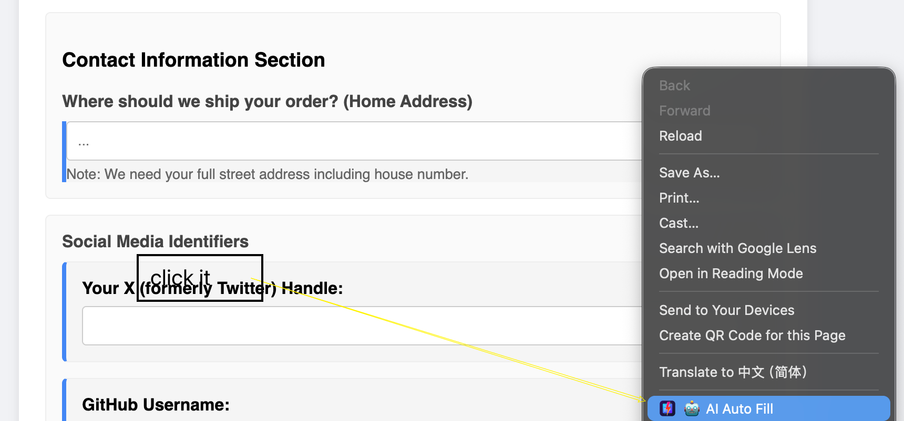

# AI Autofill - 智能表单自动填写插件

AI Autofill 是一款利用 Chrome 浏览器内置本地 AI (Gemini Nano) 实现的智能表单自动填充工具。与传统的基于 `name` 或 `id` 匹配的插件不同，它能够通过理解表单的**语义上下文**（周围的文字、标签、提示等）来精准判断该填入哪项个人信息。

---

## 🌟 核心功能

- **本地 AI 驱动**：使用 Chrome 内置的 Gemini Nano 模型，所有数据都在本地处理，无需上传云端，保护隐私。
- **语义理解**：能够识别嵌套结构、复杂的表单布局以及语义模糊的描述。
- **保密模式**：支持对敏感信息（如身份证、手机号）进行界面遮挡，仅在填写时由 AI 调用。
- **多语言支持**：界面支持中英文切换。
- **调试模式**：可视化 AI 匹配逻辑，方便查看每个输入框获取到的上下文信息。

---

## 📸 插件预览

> *此处预留插件截图位置*
>  

---

## 🛠️ 安装要求 (重要)

由于本插件使用了 Chrome 的实验性本地 AI 接口，目前仅支持以下环境：

1.  **浏览器版本**：Chrome v127 或更高版本。
2.  **平台限制**：目前仅限 **Windows, macOS, Linux**（移动端暂不支持）。
3.  **硬件要求**：建议 8GB+ 内存，并预留约 2GB 磁盘空间用于下载模型。

### 开启 Gemini Nano 步骤：

1.  打开 `chrome://flags`。
2.  启用以下选项：
    -   `Prompt API for Gemini Nano` -> 设置为 **Enabled**。
    -   `Enables optimization guide on device` -> 设置为 **Enabled BypassPrefRequirement**。
3.  重启 Chrome。
4.  前往 `chrome://components` 定位到 **Optimization Guide On Device Model**，点击“检查更新”确保模型已下载完成。

---

## 🚀 使用指南

1.  **配置信息**：右键点击插件图标进入“选项”，添加你的个人信息（如：姓名、电话、收货地址、GitHub 账号等）。
2.  **设置描述**：在添加条目时，**描述 (Description)** 非常重要。例如：对于收货地址，描述可以写“这是我默认的家庭收货地址”。
3.  **自动填写**：在任何网页表单点击右键，选择 **🤖 运行 AI 自动填写**。
4.  **随时停止**：如果 AI 正在填写中，再次点击右键菜单可立即中止任务。

---

## 📁 项目结构

- `manifest.json`: 插件配置文件 (V3)
- `content/`: 包含了核心逻辑（AI 管理、DOM 探测、自动填充）
- `options/`: 选项设置界面
- `_locales/`: 国际化多语言支持
- `background.js`: 后台服务脚本，处理右键菜单

---

## ⚠️ 注意事项

- **安全性**：模型全本地运行，不会将您的个人数据发送给 Google 或任何第三方。
- **精准度**：AI 遵循“宁可不填，绝不填错”原则。对于搜索框、验证码、密码等敏感字段，AI 会自动跳过。

---

## 📄 License

MIT
